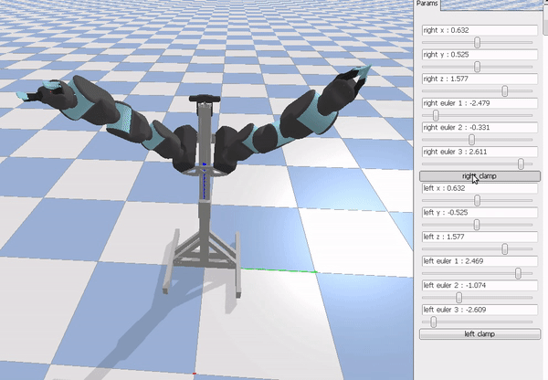

# Blue robot on pybullet

On this repo you can find Berkeley's Blue robot ready to use with pybullet. The model of the robot
has been copied from [github](https://github.com/berkeleyopenarms/blue_core) and the parts of the
robots have been colorized and the range of some of the motors expanded.



## Move each joint independently

```bash
python blue_move_all_joints.py
```

## Inverse kinematics and clamp control

```bash
python blue_move_all_joints.py
```
